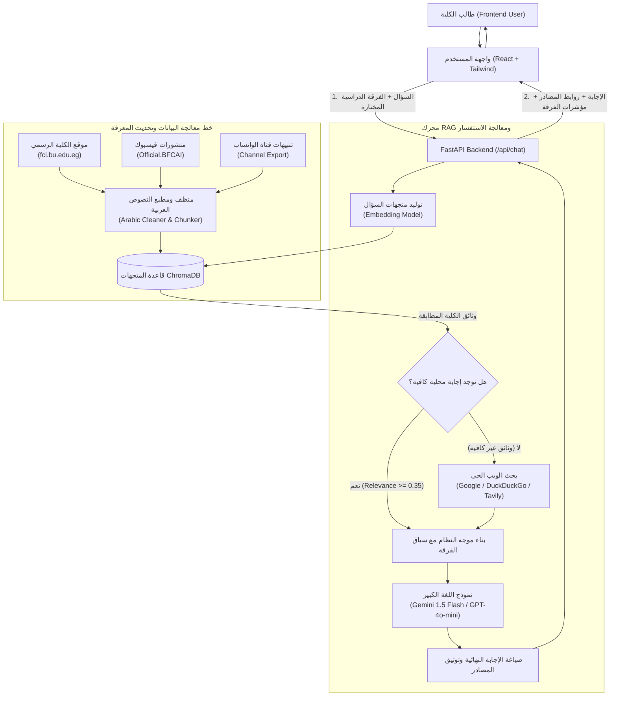

# 🏛️ بنية وتصميم النظام (System Architecture)
## BFCAI Student AI Assistant (RAG System)

يقوم المشروع على معمارية معيارية حديثة تفصل بين واجهة المستخدم (Frontend)، خادم الخدمات الذكية (Backend API)، خطوط معالجة وتغذية البيانات (Data Ingestion Pipeline)، ومحرك الـ RAG المدعوم بقاعدة المتجهات ومحرك البحث الاحتياطي.

---

### 1. المخطط البياني لسير العمل (Workflow Diagram)

---

### 2. المكونات الرئيسية (Core Components)

1. **طبقة العرض والواجهة (Frontend - React + Vite + Tailwind CSS):**
   - اختيار الفرقة الدراسية (الفرقة الأولى، الثانية، الثالثة، الرابعة، عام) لتخصيص سياق الردود.
   - نافذة محادثة شبيهة بـ ChatGPT مع دعم التنسيق البرمجي (Markdown) واللغة العربية (RTL).
   - عرض المصادر المعتمدة لكل إجابة على حدة (Website, Facebook, WhatsApp, Google Search).
   - أسئلة مقترحة سريعة (Quick Prompts) مخصصة لكل فرقة.

2. **طبقة الخادم وواجهات البرمجة (Backend - FastAPI):**
   - غير متزامن (Asynchronous / Asyncio) لضمان سرعة فائقة في معالجة طلبات الطلاب المتزامنة.
   - التحقق من صحة البيانات باستخدام Pydantic V2.
   - إتاحة نقاط اتصال RESTful للدردشة، الصحة، الفرق، والمصادر.

3. **قاعدة البيانات المتجهة (Vector Store - ChromaDB):**
   - تخزين مستمر محلياً (Persistent On-Disk).
   - دعم التصفية الدلالية (Metadata Filtering) حسب الفرقة الدراسية (`year`).

4. **محرك البحث الحي الاحتياطي (Web Search Fallback Service):**
   - يعمل كخط دفاع ثانٍ في حال لم يتم العثور على إجابة في قاعدة المعرفة المحلية المعتمدة.
   - يدعم DuckDuckGo بدون مفاتيح، مع إمكانية التبديل إلى Tavily أو Google Custom Search JSON API.

5. **نماذج اللغة الكبيرة (LLMs):**
   - دعم مباشر لـ Google Gemini (`gemini-1.5-flash`) لسرعته الفائقة ودعمه الممتاز للغة العربية.
   - دعم OpenAI (`gpt-4o-mini`).
   - وضع تشغيل محلي بدون مفاتيح (Mock Fallback) لضمان التجربة الفورية دون إعدادات معقدة.
